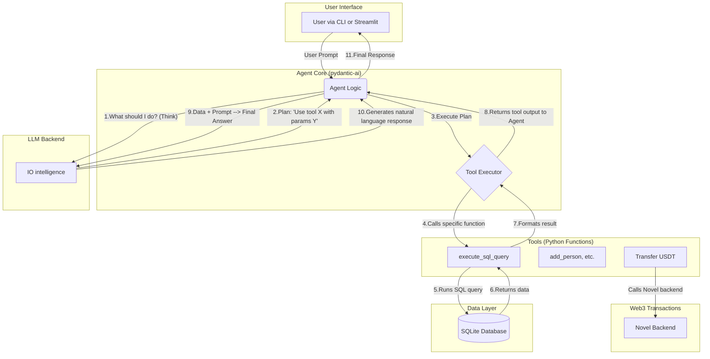

# Novel Agent

Welcome to the Novel Salary Agent, a conversational AI assistant for managing simulated Solana wallets and transactions. This project demonstrates how to build a powerful, database-aware AI agent using the Novel Ecosystem AI backend.

### The agent is available in two interfaces:

A feature-rich Command-Line Interface (CLI) built with rich.
An interactive Web Application built with streamlit.
Both applications connect to the same persistent SQLite database, so your data is always in sync.


## Key Features
- Conversational Interface: Interact with your data using natural language.
- Persistent Database: All data is stored in a local SQLite database (salary_agent.db).
- Dual Interfaces: Choose between a polished CLI or a user-friendly web app.
- Dynamic SQL Generation: The agent can answer complex questions by writing and executing its own SQL queries.
- Transparent Reasoning: See the agent's step-by-step "thinking" process before it gives a final answer.
- Rich Outputs: Get query results as formatted tables in the CLI or interactive dataframes in Streamlit.

## Use Cases & Examples
You can perform a wide range of actions, from simple lookups to complex data analysis.

- Basic Operations
  - List all registered people:
  - list persons

- Add a new person:
  - add emil with address we2323232

- Check a wallet address:
   - what is the wallet address for guru?

- Perform a transfer:
   - transfer 150 usdt from shivam to madhur


## Advanced Database Queries:
Thanks to the agent's ability to write its own SQL, you can ask much more complex questions.

- Count transactions:
    - how many transfers has guru made?

- Aggregate data:
    - what is the total amount transferred to shivam?

- Filter and sort:
    - show me all transfers over 50 usdt, sorted by amount

- Get recent activity:
    - who were the last 3 people to receive a transfer?

## Architecture and Technology
This project uses a modern AI agent architecture to translate natural language into actions. The core logic is orchestrated by the pydantic-ai framework, which uses the Novel LLM backend for all reasoning and language understanding tasks.

#### Technology Stack
- AI Framework: 
    - pydantic-ai
- LLM Backend : 
    - IO intelligence
- Transaction/Wallet Backend: 
    - Novel Ecosystem LLM
- Web UI: streamlit
- CLI: rich
- Database: sqlite3
- Data Validation: pydantic
- Data Manipulation: pandas (for the Streamlit app)

#### System Flow
The diagram below illustrates how a user's request is processed by the system.





## Calling the Novel Backend
The connection to the Novel Ecosystem's powerful AI backend is configured in one simple block in both scripts. The OpenAIProvider is used to create a client that points to Novel's API endpoint, which is compatible with the OpenAI specification. This is where the "magic" happens—every time the agent thinks or formulates a response, it makes a call to this endpoint.

Python

--- Agent and Tools ---

## IO Intelligence API configuration for Novel
IO_API_KEY = "your_api_key_here"
IO_BASE_URL = "https://api.intelligence.io.solutions/api/v1"

## This block configures the agent to use Novel's LLM

```python
model = OpenAIModel(
    model_name='Qwen/Qwen3-235B-A22B-FP8',
    provider=OpenAIProvider(base_url=IO_BASE_URL, api_key=IO_API_KEY),
)

novel_salary_agent = Agent(
    model=model,
    # ... rest of the agent configuration
)
```
Getting Started
Follow these steps to get the agent running on your local machine.

1. Prerequisites
Python 3.8+
An API key from IO-intelligence Ecosystem.

2. Installation
First, clone the repository to your local machine:

```Bash

git clone https://github.com/your-username/novel-salary-agent.git
cd novel-salary-agent
```
Next, it's recommended to create a virtual environment:

```Bash

python -m venv venv
source venv/bin/activate  # On Windows, use `venv\Scripts\activate`
Install the required Python packages from the requirements.txt file:
or use uv to sync the dependencies:
```

```Bash
pip install -r requirements.txt or
uv sync
```
3. Configuration
Open both cli_agent.py and streamlit_app.py and replace the placeholder API key with your actual Novel API key:

```Python

IO_API_KEY = "your_real_api_key_here"
```
Running the Applications
You can run either the CLI or the Streamlit web application.

To Run the CLI:
Execute the following command in your terminal:

```Bash

python agent_cli.py
```
To Run the Streamlit Web App:
Execute the following command in your terminal:

```Bash

streamlit run agent_web.py
```

This will open the web interface in your default browser.

### Connect with Novel
This project is a demonstration of the powerful and flexible infrastructure provided by Novel. To learn more, explore their offerings and follow their updates.

###  Twitter / X: @novelecosystem
### Website: novelecosystem.com (Note: Add the correct website link when available)

